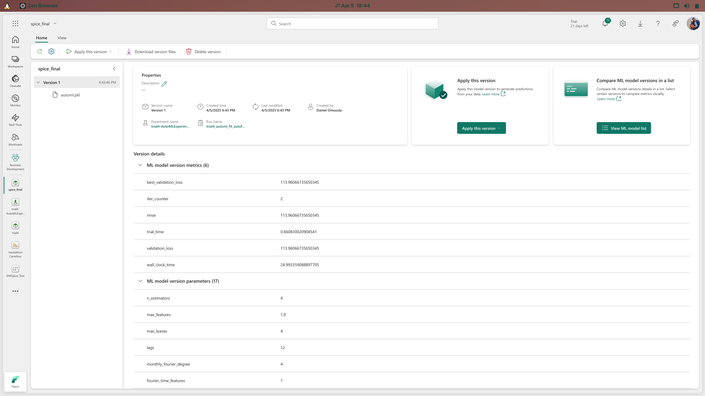

## Machine Learning Results
The results from the machine learning we undertook on our data, can be seen in the screenshot below:

## AutoML Time-Series Forecasting Results

An Automated Machine Learning (AutoML) experiment was conducted using FLAML within Microsoft Fabric to forecast the `PRICE` based on historical sales data.

### Experiment Details:
*   **Task:** Time-Series Forecasting
*   **Target Variable:** `PRICE`
*   **Time Column:** `Month`
*   **Forecast Horizon:** 5 steps (likely months)
*   **Evaluation Metric:** Root Mean Squared Error (RMSE)
*   **Input Features:** Included various categorical and numerical features like `Year`, `Dept_Name`, `Brand_Name`, `Item_Name`, `Qty`, etc. (See Input Schema in run details).
*   **Featurization:** Automatic featurization was enabled, handling categorical features ordinally and applying resampling.

### Best Model Performance:
*   **Model Type:** Extra Trees Regressor (`extra_tree`)
*   **RMSE:** ~113.96
*   **Interpretation:** The best model predicts the `PRICE` with an average error of approximately 113.96 units. The lower the RMSE, the better the model fits the data.

### Key Model Parameters:
*   **Lags:** 12 (Used the past 12 months' data)
*   **Seasonality:** Modeled using Monthly Fourier features (degree 4).
*   **Estimators (Trees):** 4
*   **Max Leaves per Tree:** 4