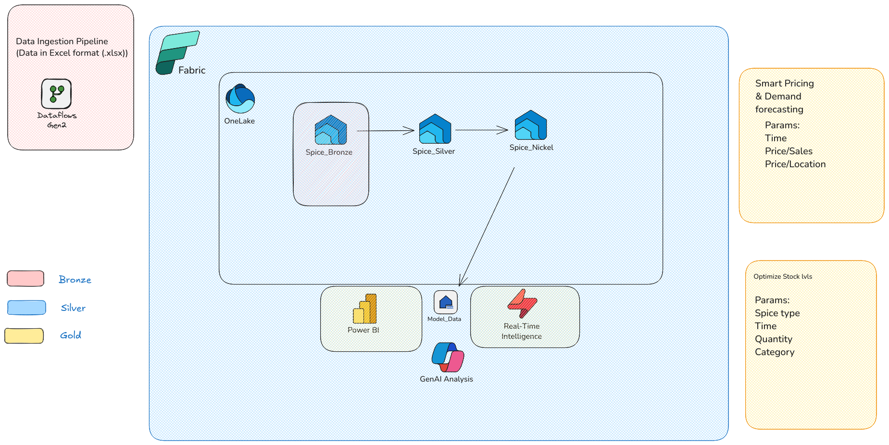
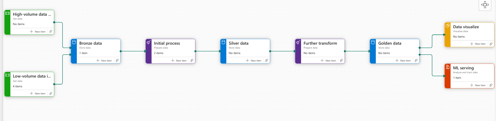
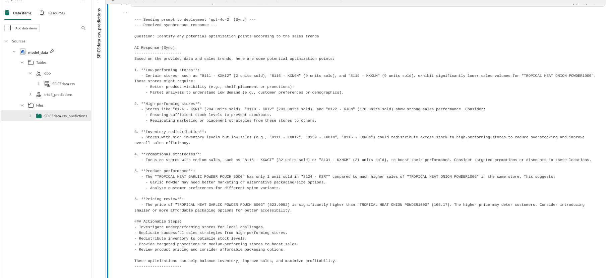

# Microsoft Fabric Hackathon Proposal: Retail Sales Prediction
## Video Presentation Overview

**Team/Submitter:** [Ujao AI ]
**Date:** 2025-04-01

## 1. Abstract/Summary

This project proposes the development of a sales prediction solution for a local retailing company,  leveraging the unified analytics capabilities of Microsoft Fabric. By implementing a Medallion architecture, we will ingest, clean, transform, and model historical sales, & relative inventory  data to generate accurate future Demand forecasts, model sales overtime and help in inventory planning. The solution aims to optimize resource allocation, and overall business strategy, ultimately driving efficiency and profitability.

## 2. Problem Statement

Local retailers often struggle with accurate sales forecasting due to complex factors like seasonality, promotions, and economic shifts. These inaccuracies lead to significant operational inefficiencies, including costly stockouts (lost sales) or overstocking (increased holding costs and waste). This project addresses the need for a reliable prediction system by analyzing common patterns from accessible data for various goods. The primary goal is to predict sales, price & demand(e.g., weekly, monthly), enabling proactive decision-making.

## 3. The Solution

The  solution:
*   **Data Ingestion:** Utilizin Dataflow Gen 2 to ingest raw sales data.
*   **Data Processing:** Implementation of a Medallion architecture (Bronze, Silver, Gold layers) within a Fabric Lakehouseusing Notebooks (PySpark) and Dataflows Gen2 for robust cleaning, transformation, and aggregation.
*   **Modeling:** Develop and train time-series forecasting models  (ARIMA, Prophet, & Multiple regression) using the curated Gold layer data within Fabric Notebooks. Utilize MLflow integrated within Fabric for experiment tracking and model management.
*   **Visualization:** Using Power BI connected to the Gold layer (Lakehouse/Warehouse) to present forecasts, model performance, and key business insights through interactive dashboards.
*   **GenAi** Leveraging Gen AI to simplify data querying, forecasting and reduce accessibility requirements to the data and analysis.The Power BI dashboard link can be found [here](https://app.fabric.microsoft.com/groups/8d3e063b-5552-4052-b919-22ef780dcf63/reports/21de9deb-26db-4c2d-aa97-0256ee62fd4e?ctid=e9fba1ee-d3b6-4595-b71c-1481db964a58&pbi_source=linkShare)

## 4. Architecture Overview

The solution follows the Medallion architecture:
*   **Bronze:** Raw data storage in OneLake.
*   **Silver:** Cleaned, conformed data stored as Delta tables in the Lakehouse.
*   **Gold:** Aggregated, analysis-ready data (features for modeling, reporting views) stored in the Lakehouse or Warehouse.

### Architecture (Medallion)

This is an overview of the architecture defining the data pipeline from start to finish

architectural Overview

The Actual Medallion Layer

### Bronze Layer

*   **Purpose:** Ingests raw, unprocessed data from source systems, we utilize a data flow gen 2 pipeline to Ingest Data
*   **Data:** Raw sales transaction data from the local retailer (e.g.,Excel Files). Data is kept in its original format with minimal changes, primarily for archival and lineage tracking.
*   **Fabric Components:** Dataflows Gen2 for ingestion, OneLake/Lakehouse for storage. Storage is done in a single lakehouse before initial transformations

Notebook implementation can be found here[Spice_Test.ipynb](pipeline/Spice_Test_1_1.ipynb):
### Silver Layer

*   **Purpose:** Enriching and Formatting Data for analysis. Data from the transformation steps is further enriched in this level
*   **Data:** Raw data is transformed, validated, and standardized. This includes handling missing values, correcting data types. We also undertook a lot of pivoting of data to the shape that we wanted in this stage.
*   **Fabric Components:** Notebooks (PySpark/Spark SQL) & Dataflows Gen2 for transformations, Lakehouse for storage.

Notebook Implementation can be found here[Spice_Test.ipynb](pipeline/Spice_Test_1_1.ipynb):

### Gold Layer

*   **Purpose:** Curated, aggregated data optimized for specific business use cases and analytics.
*   **Data:** Data is aggregated to the required level for sales prediction (Annual sales per product/store). Features relevant for forecasting models are engineered. This layer serves as the source for reporting dashboards and machine learning models.
*   **Fabric Components:** Notebooks (PySpark/Spark SQL) for aggregation and feature engineering, Lakehouse/Warehouse for storage, Power BI datasets for reporting.

Notebook Implementation can be found here[Automl.ipynb](Machine Learning/prediction/Automl.ipynb):

# Implementation Details

## Data Preparation Flow

1.  **Ingestion:** Raw sales data files are ingested into the Bronze layer of the Lakehouse using Fabric Data Factory pipelines or Dataflows.
2.  **Initial Storage:** Data is stored in its original format in the 'Files' section or as basic Delta tables within the Bronze zone of OneLake.

## Data Processing Flow

1.  **Bronze to Silver:** Notebooks (like `Spice_Test.ipynb`) reads raw data (e.g., `SalesData.csv`) from the Bronze layer. Cleaning involves:
    *   Handling null values in key columns (`Quantity Sold`, `Revenue`).
    *   Converting date columns to the correct `DateType`.
    *   Extracting date components (`Year`, `Month`, `Day`, `Weekday`) for easier analysis and feature engineering.
    The cleaned, validated data is stored as a Delta table (e.g., `CleanedSalesData`) in the Silver layer.
2.  **Silver to Gold:** Notebooks process the cleaned Silver layer data. This involves:
    *   Aggregating data to the desired granularity (e.g., calculating total monthly quantity and revenue per product).
    *   Transforming data into a structure suitable for modeling, such as pivoting the table to have time periods (Year, Month) as rows and products as columns, with sales quantity as values (e.g., `PivotedSalesQuantity` table).
    *   Further feature engineering (lag features, rolling averages) are applied here.
    The final, curated, and aggregated data is stored in the Gold layer, ready for reporting and ML model training.

## Fabric Features & Azure AI

*   **Microsoft Fabric:** Leverages OneLake, Lakehouse, Warehouse, Data Factory, Dataflows Gen2, Notebooks (Spark), MLflow integration, and Power BI for an integrated data platform experience.
*   **Azure AI Implementation:**
    We implemented Azure OPen AI using gpt-40 and using fabric connectors to the gold data warehouse. We also hooked up the outout of our multiple regression machine learning models to the Large Langugage model to get more clarity on the predictions, and forecasting. The notebook implementation can be found here [Genai.ipynb](GenAI/Genai.ipynb)
Some sample responses can be seen in the screenshots below:

